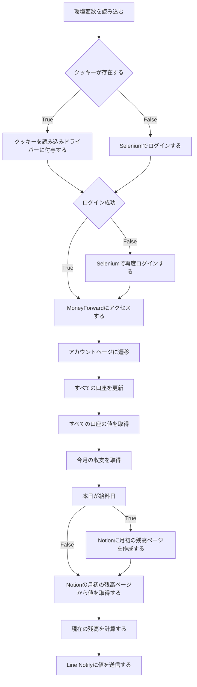

# 概要
- 口座の更新
    - マネーフォワードの口座を一括で更新することができる
        - マネーフォワードの口座を一括更新するにはプレミアムプランに入る必要がある
- 今月の残額計算
    - 銀行口座の残高、クレジットカードの使用高、今月の支出を計算しLineに送信する
- 証券口座の残高
    - 証券口座の残高をLineに送信する

# 技術
- 言語
    - Python
- ライブラリ
    - Selenium
    - requests
    - beautifulSoup
- API
    - Notion API
    - Line Notify

# 実行方法
## リポジトリのクローン
```shell
git clone git@github.com:RRRRRRR-777/ParseMoneyForward.git
```
## `rye`のインストール
### bashの場合
```shell
curl -sSf https://rye-up.com/get | bash
echo 'source "$HOME/.rye/env"' >> ~/.bashrc
```
### zshの場合
```shell
curl -sSf https://rye-up.com/get | zsh
echo 'source "$HOME/.rye/env"' >> ~/.zshrc
```

## 処理の実行
```shell
rye sync
rye run python src/NasdaqTrade/main.py
```

# 環境変数

|  変数名 | 値 |
|---|---|
|EMAIL|マネーフォワードのメールアドレス|
|PASWAORD|マネーフォワードのパスワード|
|LINE_NOTIFY|Line Notifyのトークン|
|NOTION_KEY|Notionのトークン|
|NOTION_DATABASE_ID|Notionの任意のデータベースのID|
|NOTION_PAGE_ID|Notionにページ作成する親ページのID|
|HOUSE_BANK|お家銀行|
|RAKUTEN_BANK|楽天銀行|
|HOUSE_RENT|家賃|
|FIXED_COST|固定費|
|FOOD_EXPENSE|自炊費|


# フローチャート

